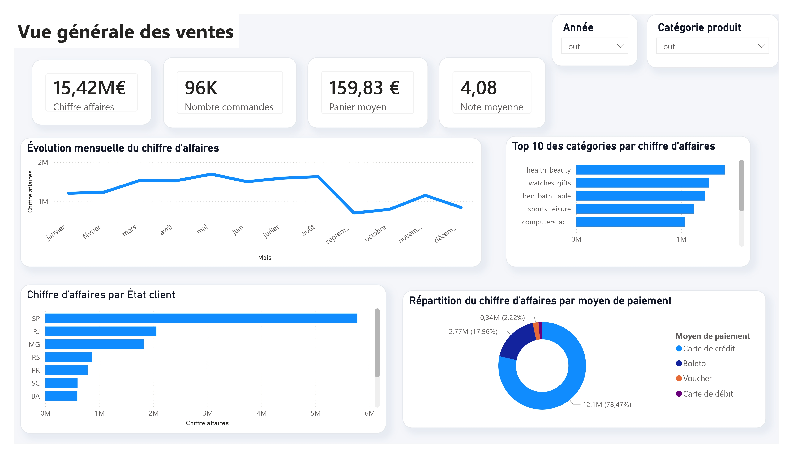
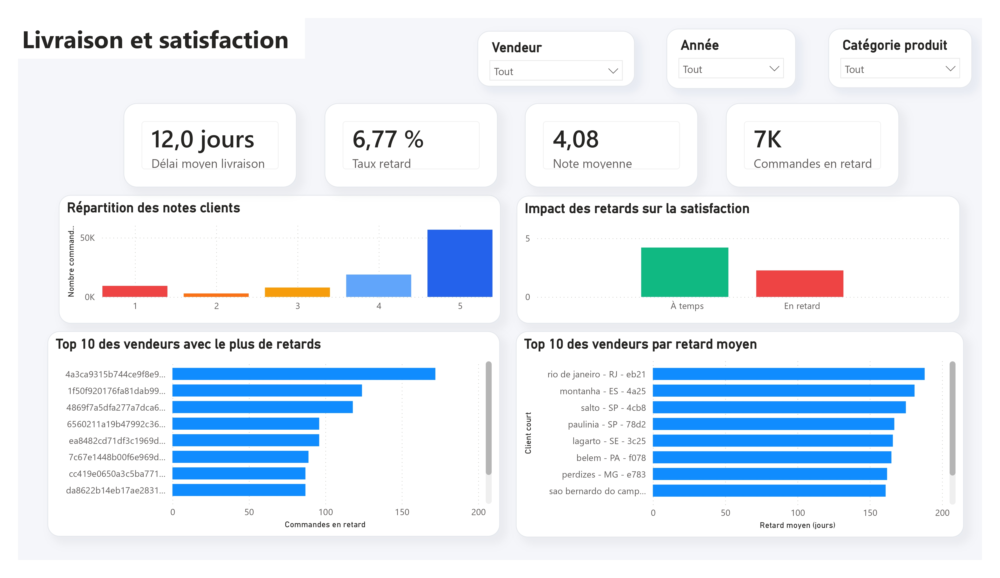
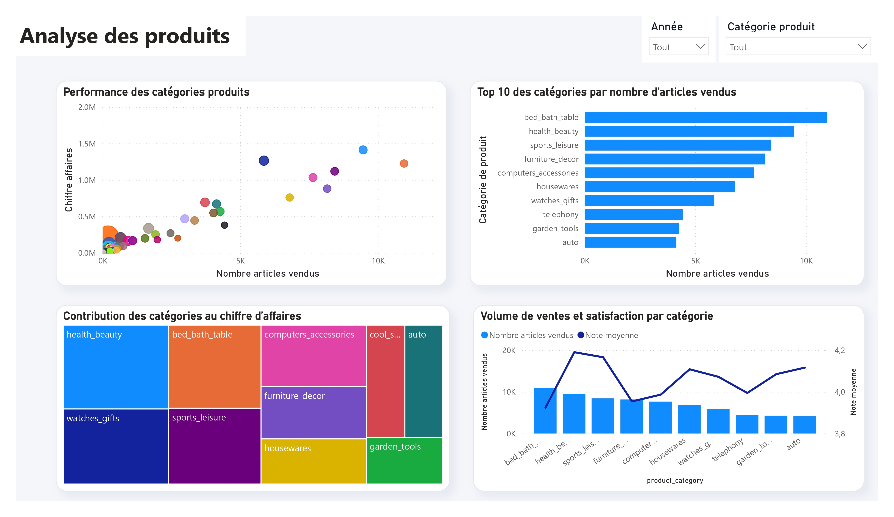
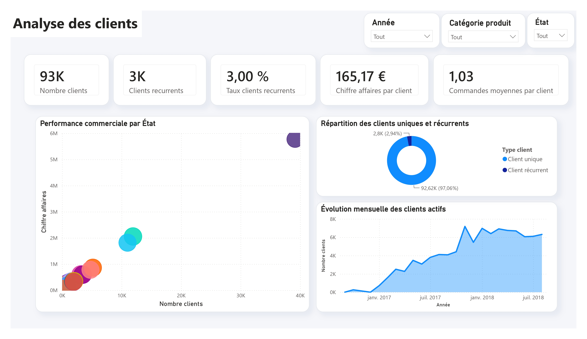
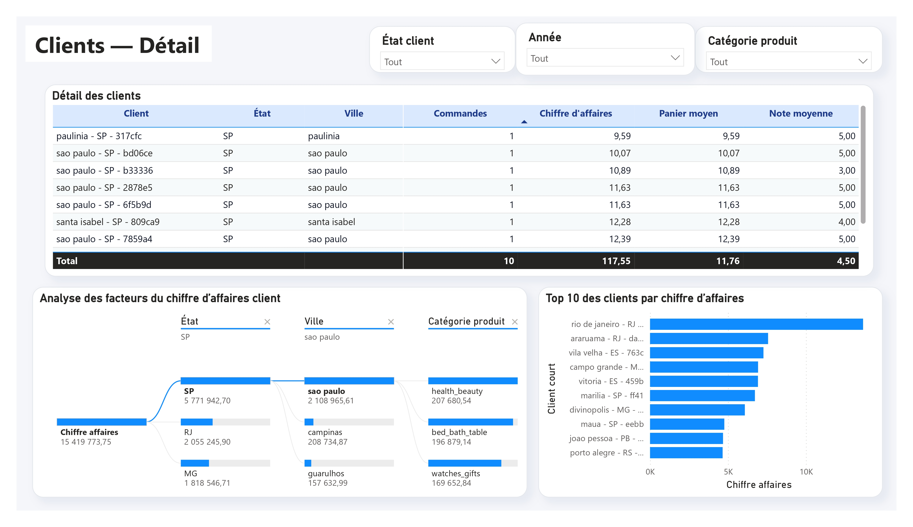

# Retail Analytics Power BI Platform

Projet de data analytics de bout en bout basé sur le jeu de données e-commerce Olist.

L’objectif est de construire une chaîne complète, depuis le traitement des données jusqu’à la restitution décisionnelle :

- ingestion et nettoyage avec Python ;
- stockage dans PostgreSQL ;
- modélisation en étoile ;
- création de mesures DAX ;
- analyse dans Power BI ;
- validation des KPI avec SQL ;
- documentation pour un portfolio GitHub.

---

## Aperçu du dashboard

### Vue générale des ventes



### Livraison et satisfaction



### Analyse des produits



### Analyse des clients



### Clients — Détail



---

## Objectifs d’analyse

Le dashboard permet d’étudier :

- le chiffre d’affaires ;
- le nombre de commandes ;
- le panier moyen ;
- la note moyenne ;
- les performances des catégories de produits ;
- les délais de livraison ;
- le taux de retard ;
- l’impact des retards sur la satisfaction ;
- la performance des vendeurs ;
- la répartition des clients par État ;
- la fidélisation et la récurrence client.

---

## Architecture technique

```text
Données brutes
    ↓
Pipeline Python
    ↓
Données nettoyées / Parquet
    ↓
PostgreSQL
    ↓
Modèle en étoile
    ↓
Power BI
    ↓
Dashboard analytique
```

### Modèle de données

Le modèle principal contient :

- `fact_sales`
- `dim_customer`
- `dim_product`
- `dim_seller`
- `dim_date`

Relations principales :

```text
dim_customer[customer_key]  1 → * fact_sales[customer_key]
dim_product[product_key]    1 → * fact_sales[product_key]
dim_seller[seller_key]      1 → * fact_sales[seller_key]
dim_date[date_key]          1 → * fact_sales[date_key]
```

---

## Technologies utilisées

### Data Engineering

- Python 3.11
- Pandas
- Parquet
- Pytest
- Docker
- Docker Compose

### Base de données

- PostgreSQL 16
- SQL
- Modélisation dimensionnelle
- Schéma en étoile

### Business Intelligence

- Power BI Desktop
- DAX
- Power Query
- Visualisations interactives
- Segments et filtres

### Outils

- Visual Studio Code
- Git
- GitHub
- JupyterLab

---

## Structure du dépôt

```text
retail-analytics-powerbi-platform/
│
├── data/
│   ├── raw/
│   └── processed/
│
├── src/
│   ├── config.py
│   ├── ingestion.py
│   ├── cleaning.py
│   ├── validation.py
│   ├── load_postgres.py
│   └── build_star_schema.py
│
├── sql/
│   ├── ddl/
│   ├── transformations/
│   └── analytics/
│
├── notebooks/
│   └── 01_data_audit.ipynb
│
├── tests/
│   ├── unit/
│   └── integration/
│
├── dashboards/
│   └── powerbi/
│       ├── retail_analytics_dashboard.pbix
│       └── retail_analytics_dashboard.pbit
│
├── docs/
│   ├── images/
│   ├── kpi_definitions.md
│   └── github_release_checklist.md
│
├── docker-compose.yml
├── pyproject.toml
├── .gitignore
└── README.md
```

---

## Pipeline de données

Le pipeline réalise les étapes suivantes :

1. lecture des fichiers sources ;
2. contrôle du schéma ;
3. nettoyage des valeurs ;
4. normalisation des colonnes ;
5. validation de la qualité des données ;
6. génération d’un fichier Parquet ;
7. chargement dans PostgreSQL ;
8. alimentation du modèle en étoile.

Exécution :

```bash
python -m src.ingestion
```

Résultat actuel :

```text
112 650 lignes traitées
```

---

## Démarrer PostgreSQL

```bash
docker compose up -d
```

Vérifier les conteneurs :

```bash
docker ps
```

Se connecter à PostgreSQL :

```bash
docker exec -it retail_analytics_postgres \
  psql -U retail_user -d retail_analytics
```

Arrêter les services :

```bash
docker compose down
```

Supprimer également les volumes :

```bash
docker compose down -v
```

---

## Exécuter les tests

```bash
pytest
```

État actuel :

```text
5 tests réussis
```

---

## Principaux KPI

Les définitions complètes sont disponibles dans :

```text
docs/kpi_definitions.md
```

| KPI | Valeur |
|---|---:|
| Chiffre d’affaires | 15,42 M€ |
| Nombre de commandes livrées | environ 96 K |
| Panier moyen | 159,83 € |
| Note moyenne des commandes livrées | 4,08 |
| Délai moyen de livraison | environ 12 jours |
| Taux de retard | environ 6,77 % |
| Nombre de clients | environ 93 K |
| Taux de clients récurrents | environ 3 % |

---

## Pages Power BI

### 1. Vue générale des ventes

- chiffre d’affaires ;
- nombre de commandes ;
- panier moyen ;
- note moyenne ;
- évolution mensuelle ;
- catégories principales ;
- chiffre d’affaires par État ;
- répartition par moyen de paiement.

### 2. Livraison et satisfaction

- délai moyen de livraison ;
- taux de retard ;
- commandes en retard ;
- distribution des notes ;
- impact des retards sur la satisfaction ;
- vendeurs avec le plus de retards.

### 3. Analyse des produits

- performance des catégories ;
- nombre d’articles vendus ;
- contribution au chiffre d’affaires ;
- comparaison entre volume de ventes et satisfaction.

### 4. Analyse des clients

- nombre de clients ;
- clients récurrents ;
- taux de récurrence ;
- chiffre d’affaires par client ;
- commandes moyennes par client ;
- performance par État ;
- évolution mensuelle des clients actifs.

### 5. Clients — Détail

- table détaillée ;
- arbre de décomposition ;
- Top 10 des clients par chiffre d’affaires ;
- filtres par année, État et catégorie.

---

## Validation SQL

Exemple de validation du chiffre d’affaires :

```sql
SELECT
    ROUND(SUM(total_item_value)::numeric, 2) AS chiffre_affaires
FROM public.fact_sales
WHERE order_status = 'delivered';
```

Exemple de validation de la note moyenne :

```sql
SELECT
    ROUND(AVG(review_score)::numeric, 2) AS note_moyenne
FROM public.fact_sales
WHERE order_status = 'delivered';
```

Résultat validé :

```text
4.08
```

---

## Sécurité et publication

Ne jamais publier :

- les fichiers `.env` ;
- des mots de passe PostgreSQL ;
- des clés ou tokens ;
- des fichiers temporaires ;
- l’environnement virtuel ;
- les caches Python ;
- des données sensibles.

---

## Améliorations futures

- automatiser les contrôles de qualité ;
- ajouter GitHub Actions ;
- ajouter des tests d’intégration PostgreSQL ;
- publier une démonstration vidéo ;
- utiliser dbt pour les transformations ;
- déployer le dashboard dans Power BI Service ;
- ajouter des analyses RFM et de cohortes.

---

## Auteur

Projet réalisé pour un portfolio professionnel orienté Data Analyst, BI et Data Engineering.
